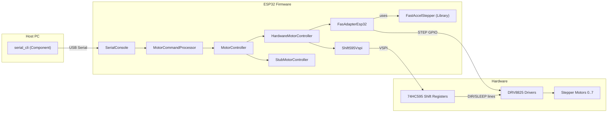
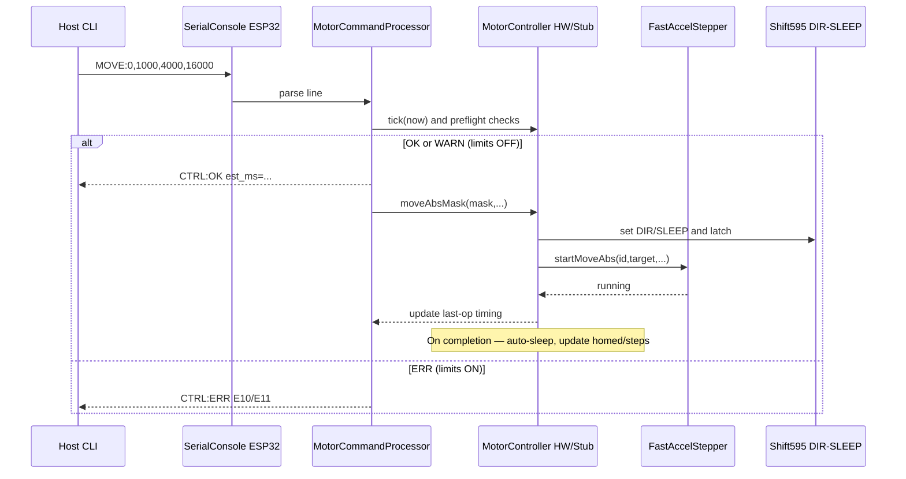

# Kinetic Mirror Matrix (ESP32)

Firmware + host tools to drive up to 8 stepper‑driven mirrors from a single ESP32 using FastAccelStepper for motion and two 74HC595 shift registers for per‑motor DIR and SLEEP. A simple human‑readable serial protocol provides immediate control from any laptop; diagnostics and thermal run‑time limits keep demos stable and safe.

- [Roadmap](./agent-os/product/roadmap.md)
- [Tech stack](./agent-os/product/tech-stack.md)
- [Wiring guide](./docs/esp32-74hc595-wiring.md)

## What It Does

- Exposes a USB serial protocol (v1) with commands: HELP, STATUS, MOVE, HOME, WAKE, SLEEP
- Drives 8 DRV8825 steppers concurrently (full‑step for v1). DIR and SLEEP are via 74HC595 shift registers to reduce GPIO use.
- Auto-sleeps motors by default to avoid overheating and to reduce power consumption.
- Implements bump‑stop homing, zeroing at midpoint
- Reports per‑motor status including homed, steps since home, and thermal budget metrics
- Enforces runtime/cooldown budgets; toggleable at runtime for lab work
- Ships a Python CLI for quick tests and an interactive TUI view

## Features (High‑Level)

- Serial protocol v1 with stable grammar and shortcuts
  - See: [MotorCommandProcessor.cpp](./lib/MotorControl/src/MotorCommandProcessor.cpp), [Serial command protocol v1 spec](./agent-os/specs/2025-10-15-serial-command-protocol-v1/spec.md)
- 8‑motor hardware bring‑up via FastAccelStepper + 2×74HC595 (DIR/SLEEP)
  - See: [FasAdapterEsp32.cpp](./src/drivers/Esp32/FasAdapterEsp32.cpp), [Shift595Vspi.cpp](./src/drivers/Esp32/Shift595Vspi.cpp), [Esp32Dev.hpp](./include/boards/Esp32Dev.hpp)
- Homing & baseline calibration (bump‑stop)
  - See: [HardwareMotorController.cpp](./lib/MotorControl/src/HardwareMotorController.cpp), spec: [Homing & baseline calibration spec](./agent-os/specs/2025-10-17-homing-baseline-calibration-bump-stop/spec.md)
- Status & diagnostics (homed, steps_since_home, budget_s, ttfc_s)
  - See: [MotorCommandProcessor.cpp](./lib/MotorControl/src/MotorCommandProcessor.cpp), spec: [Status & diagnostics spec](./agent-os/specs/2025-10-17-status-diagnostics/spec.md)
- Thermal limits enforcement (preflight checks, WARN/ERR, last‑op timing)
  - See: [MotorCommandProcessor.cpp](./lib/MotorControl/src/MotorCommandProcessor.cpp), [MotorControlConstants.h](./lib/MotorControl/include/MotorControl/MotorControlConstants.h), spec: [Thermal limits enforcement spec](./agent-os/specs/2025-10-17-thermal-limits-enforcement/spec.md)
- Host CLI (Python) incl. interactive TUI
  - See: [tools/serial_cli](./tools/serial_cli/)

## Architecture

### MOVE/HOME Command Flow

## Quickstart

Prereqs

- PlatformIO Core (CLI)
- Python 3.9+ (for host CLI)

Build and Upload (ESP32)

- Configure your board pins/wiring: [Esp32Dev.hpp](./include/boards/Esp32Dev.hpp), [wiring guide](./docs/esp32-74hc595-wiring.md)
- Build: `pio run -e esp32dev`
- Upload: `pio run -e esp32dev -t upload`
- Monitor: `pio device monitor -b 115200`
  - On boot you should see: `CTRL:READY Serial v1 — send HELP`

Host CLI

- From repo root: `python -m serial_cli --help`

- Examples:
  - `python -m serial_cli interactive --port /dev/ttyUSB0`  #  polls and displays STATUS at ~2 Hz, displays device responses to commands
  - `python -m serial_cli help --port /dev/ttyUSB0`
  - `python -m serial_cli status --port /dev/ttyUSB0`
  - `python -m serial_cli move --port /dev/ttyUSB0 0 800 --speed 4000 --accel 16000`
  - `python -m serial_cli home --port /dev/ttyUSB0 0 --overshoot 800 --backoff 150`
- CLI module: [tools/serial_cli](./tools/serial_cli/)

Tests

- Native: `pio test -e native`
- On‑Device: `pio test -e esp32dev`

## Setup & Tuning Knobs

- Build flags and test routing: [platformio.ini](./platformio.ini)
  - `-DUSE_HARDWARE_BACKEND` selects hardware controller for ESP32 env
  - Default test filter limits on‑device tests to driver layer
- Motion/limits constants: [MotorControlConstants.h](./lib/MotorControl/include/MotorControl/MotorControlConstants.h)
  - Defaults: `DEFAULT_SPEED_SPS`, `DEFAULT_ACCEL_SPS2`
  - Limits: `MIN_POS_STEPS`, `MAX_POS_STEPS`
  - Thermal: `MAX_RUNNING_TIME_S`, `MAX_COOL_DOWN_TIME_S`, refill rate (derived)
- FastAccelStepper integration: [FasAdapterEsp32.cpp](./src/drivers/Esp32/FasAdapterEsp32.cpp)
  - Auto‑enable, `setDelayToEnable(2000)` µs, external‑pin callbacks
- Shift‑register I/O and OE gating: [Shift595Vspi.cpp](./src/drivers/Esp32/Shift595Vspi.cpp)
- Board pin map: [Esp32Dev.hpp](./include/boards/Esp32Dev.hpp)
- Filesystem for static assets/presets (optional):
  - [platformio.ini](./platformio.ini) → littlefs, prebuild gzip: [tools/gzip_fs.py](./tools/gzip_fs.py), sources in `data_src/`

Runtime Controls (device)

- `GET THERMAL_LIMITING` → `CTRL:OK THERMAL_LIMITING=ON|OFF max_budget_s=N`
- `SET THERMAL_LIMITING=OFF|ON`
- `GET LAST_OP_TIMING[:<id|ALL>]` to validate estimates (`est_ms`) and actual durations

## Protocol Cheatsheet (links)

- Highlights (grammar):
  - `MOVE:<id|ALL>,<abs_steps>[,<speed>][,<accel>]`
  - `HOME:<id|ALL>[,<overshoot>][,<backoff>][,<speed>][,<accel>][,<full_range>]`
  - `STATUS`, `WAKE:<id|ALL>`, `SLEEP:<id|ALL>`
  - `GET LAST_OP_TIMING[:<id|ALL>]`, `GET THERMAL_LIMITING`, `SET THERMAL_LIMITING=OFF|ON`
  - Responses: `CTRL:OK` (MOVE/HOME include `est_ms`), `CTRL:ERR E..`, and `CTRL:WARN ...` when enforcement is OFF
- Full spec: [Serial command protocol v1 spec](./agent-os/specs/2025-10-15-serial-command-protocol-v1/spec.md)
- HELP source: [MotorCommandProcessor.cpp](./lib/MotorControl/src/MotorCommandProcessor.cpp)

## Repo Map (quick links)

- Firmware console: [SerialConsole.cpp](./src/console/SerialConsole.cpp)
- Command processor: [MotorCommandProcessor.cpp](./lib/MotorControl/src/MotorCommandProcessor.cpp)
- Hardware controller: [HardwareMotorController.cpp](./lib/MotorControl/src/HardwareMotorController.cpp)
- FastAccelStepper adapter: [FasAdapterEsp32.cpp](./src/drivers/Esp32/FasAdapterEsp32.cpp)
- 74HC595 driver: [Shift595Vspi.cpp](./src/drivers/Esp32/Shift595Vspi.cpp)
- Constants: [MotorControlConstants.h](./lib/MotorControl/include/MotorControl/MotorControlConstants.h)
- Tests (C++): [test_MotorControl](./test/test_MotorControl/), [test_Drivers](./test/test_Drivers/)
- Host CLI: [tools/serial_cli](./tools/serial_cli/)
