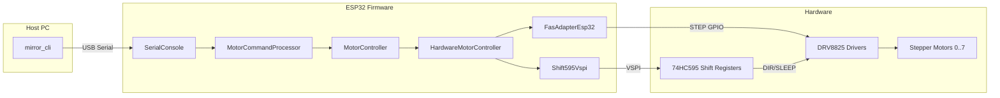

# Kinetic Mirror Matrix (ESP32)

Firmware + host tools to drive up to 8 stepper-driven mirrors from a single ESP32 using FastAccelStepper for motion and two 74HC595 shift registers for per-motor DIR and SLEEP. A simple human-readable serial protocol provides immediate control from any laptop; diagnostics and thermal run-time limits keep demos stable and safe.

**Quick Links:** [Build & Deployment](./docs/DEPLOYMENT.md) · [Wiring Guide](./docs/esp32-74hc595-wiring.md) · [Control UI](https://github.com/szerintedmi/mirror-matrix-control-ui) · [Tech Stack](./agent-os/product/tech-stack.md)

[](https://www.youtube.com/embed/aJeB7yPpRAY)

[](https://www.youtube.com/embed/KHulZtR2Qkg)


## What It Does

- **Multi-controller support via MQTT**: Control multiple ESP32 nodes from a single CLI/TUI session
- **Dual-network Wi-Fi**: Primary + secondary credentials with automatic failover; safely update credentials fleet-wide via MQTT
- **OTA firmware updates**: Update firmware and filesystem over the network via PlatformIO
- **Real-time telemetry**: MQTT-based status publishing (1-5 Hz) with per-motor state
- **Serial and MQTT command interface**: Human-readable protocol (`MOVE`, `HOME`, `STATUS`, etc.)
- Drives 8 DRV8825 steppers concurrently (configurable microstepping: full to 1/32, default 1/32)
- Auto-sleeps motors to avoid overheating; runtime/cooldown thermal budgets
- Bump-stop homing with configurable overshoot and backoff
- Python CLI with interactive TUI for quick testing and live control

## Architecture


```mermaid
flowchart LR
  subgraph "Host PC"
    CLI["mirror_cli"]
  end

  subgraph "ESP32 Firmware"
    Console["SerialConsole"]
    MCP["MotorCommandProcessor"]
    MC["MotorController"]
    HWC["HardwareMotorController"]
    FAS["FasAdapterEsp32"]
    SR["Shift595Vspi"]
  end

  subgraph "Hardware"
    DRV["DRV8825 Drivers"]
    SRIC["74HC595 Shift Registers"]
    Motors["Stepper Motors 0..7"]
  end

  CLI -->|USB Serial| Console
  Console --> MCP --> MC --> HWC
  HWC --> FAS -->|STEP GPIO| DRV
  HWC --> SR -->|VSPI| SRIC -->|DIR/SLEEP| DRV
  DRV --> Motors
```

## Quickstart

**Prerequisites:** PlatformIO Core (CLI), Python 3.13+ with Poetry

```bash
# Build & upload firmware
pio run -e esp32DedicatedStep -t upload
pio device monitor -b 115200               # Verify: CTRL:READY Serial v1

# Build & upload filesystem (Wi-Fi portal)
pio run -e esp32DedicatedStep -t buildfs && pio run -e esp32DedicatedStep -t uploadfs

# Multi-device OTA deployment
cp tools/deploy/ota_devices.toml.example tools/deploy/ota_devices.toml
# Edit ota_devices.toml with your device IPs
poetry run python -m tools.deploy.ota_deploy  # Build and deploy to all devices
```

See [Build & Deployment Guide](./docs/DEPLOYMENT.md) for OTA updates, testing, and linting.

### Host CLI

```bash
poetry install                             # Install dependencies

# Interactive TUI (serial)
poetry run python -m mirror_cli interactive --port /dev/ttyUSB0

# Interactive TUI (MQTT - control multiple nodes)
poetry run python -m mirror_cli interactive --transport mqtt

# Single commands
poetry run python -m mirror_cli move --port /dev/ttyUSB0 0 800
poetry run python -m mirror_cli home --port /dev/ttyUSB0 0 --overshoot 800
```

CLI source: [tools/mirror_cli](./tools/mirror_cli/)

## MQTT Telemetry

### Status Topic (`devices/<mac>/status`)

Real-time motor telemetry published at 1-5 Hz:

- Publishes aggregate snapshots (QoS0, non-retained)
- Payload: `{"node_state":"ready","ip":"<ipv4>","motors":{"0":{...}}}`
- Offline LWT: `{"node_state":"offline","motors":{}}`
- Cadence: 1 Hz idle, 5 Hz while motors moving, change-driven bursts between ticks
- Includes per-motor: position, moving state, thermal budget, speed, timing

### Config Topic (`devices/<mac>/config`)

Device configuration published on change with `retain=true`:

- Publishes only when config changes (not every status update)
- Retained so new subscribers get current config immediately
- Payload: `{"thermal_limiting":"ON","max_budget_s":90,"microstep":"1/32","microstep_mult":32,"speed":4000,"accel":16000,"decel":16000}`
- Auto-publishes after `SET THERMAL_LIMITING`, `SET MICROSTEP`, or speed/accel changes

### Connection Management

- Auto-reconnects with exponential backoff on broker loss

### Runtime MQTT Configuration

```
MQTT:GET_CONFIG                            # Show active broker config
MQTT:SET_CONFIG host=<fqdn> port=<port>    # Update specific fields
MQTT:SET_CONFIG RESET                      # Reset to compile-time defaults
```

Schema: [`docs/mqtt-status-schema.md`](./docs/mqtt-status-schema.md), [`docs/mqtt-config-schema.md`](./docs/mqtt-config-schema.md), [`docs/mqtt-command-schema.md`](./docs/mqtt-command-schema.md)

## Wi-Fi Onboarding

Devices support **primary** (home) and **secondary** (hotspot) networks with automatic failover.

1. Power device with no credentials (hold BOOT 5s to clear existing)
2. Join `SOFT_AP_SSID_PREFIX + MAC` using password from `include/secrets.h`
3. Browse to `http://192.168.4.1/` to configure networks

Status LED (GPIO2): Fast blink = SoftAP active, Slow blink = Connecting, Solid = Connected

See [Build & Deployment Guide](./docs/DEPLOYMENT.md) for serial commands, HTTP API, and OTA updates.

## Protocol Reference

```
MOVE:<id|ALL>,<abs_steps>[,<speed>][,<accel>]
HOME:<id|ALL>[,<overshoot>][,<backoff>][,<speed>][,<accel>][,<full_range>]
STATUS
WAKE:<id|ALL>
SLEEP:<id|ALL>
GET [ALL]
GET LAST_OP_TIMING[:<id|ALL>]
GET THERMAL_LIMITING
GET MICROSTEP
SET THERMAL_LIMITING=OFF|ON
SET MICROSTEP=FULL|HALF|1/4|1/8|1/16|1/32
```

Responses: `CTRL:ACK` (MOVE/HOME include `est_ms`), `CTRL:ERR E..`, `CTRL:WARN ...`

Full spec: [Serial command protocol v1](./agent-os/specs/2025-10-15-serial-command-protocol-v1/spec.md)

## Key Files

| Component | Location |
|-----------|----------|
| Firmware console | [src/console/SerialConsole.cpp](./src/console/SerialConsole.cpp) |
| Command processor | [lib/MotorControl/src/MotorCommandProcessor.cpp](./lib/MotorControl/src/MotorCommandProcessor.cpp) |
| Command pipeline | [lib/MotorControl/src/command/](./lib/MotorControl/src/command/) |
| Hardware controller | [lib/MotorControl/src/HardwareMotorController.cpp](./lib/MotorControl/src/HardwareMotorController.cpp) |
| FastAccelStepper adapter | [src/drivers/Esp32/FasAdapterEsp32.cpp](./src/drivers/Esp32/FasAdapterEsp32.cpp) |
| 74HC595 driver | [src/drivers/Esp32/Shift595Vspi.cpp](./src/drivers/Esp32/Shift595Vspi.cpp) |
| Constants | [lib/MotorControl/include/MotorControl/MotorControlConstants.h](./lib/MotorControl/include/MotorControl/MotorControlConstants.h) |
| Board pins | [include/boards/Esp32Dev.hpp](./include/boards/Esp32Dev.hpp) |
| Wi-Fi onboarding | [lib/net_onboarding/src/NetOnboarding.cpp](./lib/net_onboarding/src/NetOnboarding.cpp) |
| OTA manager | [lib/ota_manager/src/OtaManager.cpp](./lib/ota_manager/src/OtaManager.cpp) |
| Host CLI | [tools/mirror_cli/](./tools/mirror_cli/) |
| C++ tests | [test/test_MotorControl/](./test/test_MotorControl/), [test/test_Drivers/](./test/test_Drivers/) |

## Configuration

Build flags and motion constants are documented in the [Build & Deployment Guide](./docs/DEPLOYMENT.md#configuration).
